# LibreVote

## Проверяемое P2P-голосование с анонимными бюллетенями

**Тайминг: около 10 минут.** От CLI до результата, через каждый слой системы.

`Object log + локальная валидация + blind tokens + threshold tally`

<!-- speaker: 20 секунд. Главная мысль: LibreVote не просит доверять серверу. Каждый узел хранит объекты, сам их проверяет и сам пересчитывает результат. -->

---

# Главный Тезис

LibreVote строит доверие не через центральный сервер, а через три механизма:

1. **Immutable object log:** все важные события являются неизменяемыми объектами.
2. **Детерминированная локальная проверка:** каждый узел сам решает, что валидно.
3. **Криптографическая приватность:** право голоса отделяется от личности через blind tokens, а выбор шифруется threshold-ключом.

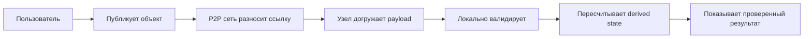

<!-- speaker: 30 секунд. Подчеркнуть: сеть только доставляет, но не делает объект истинным. Результат тоже не авторитетен, пока узел не пересчитал его сам. -->

---

# Карта Слоев

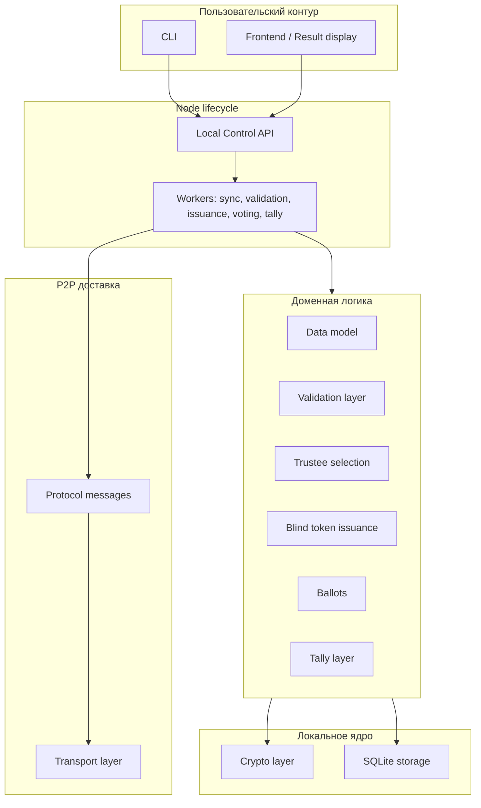

<!-- speaker: 45 секунд. Это главный слайд про слои. Снизу транспорт, выше протокол сообщений, рядом локальное ядро, сверху доменная логика и CLI. -->

---

# 1. CLI И Local Control API

**Роль:** безопасная точка входа для оператора, избирателя и trustee.

CLI не должен напрямую менять SQLite и не должен обходить node process. Он вызывает локальный control API работающего узла.

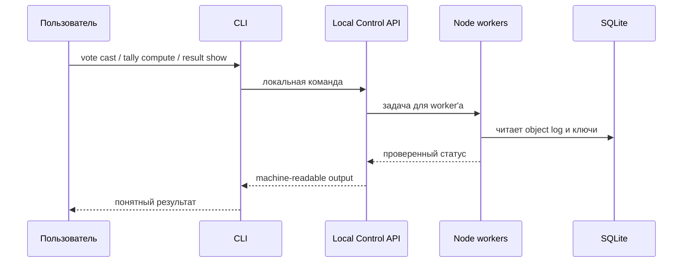

**Почему отдельный слой важен:** команды пользователя остаются воспроизводимыми, а вся доменная логика проходит через один node lifecycle.

<!-- speaker: 20 секунд. У CLI роль интерфейса, а не источника истины. Это снижает риск, что разные команды создадут разные правила работы с данными. -->

---

# 2. Node Lifecycle

**Роль:** собрать транспорт, сеть, хранилище, ключи и фоновые процессы в один управляемый узел.

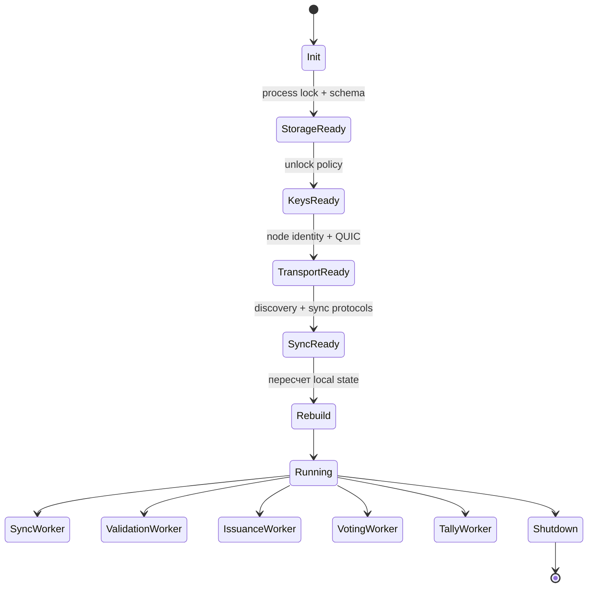

**Ключевая идея:** после падения узел может восстановиться из object log и заново построить derived state.

<!-- speaker: 20 секунд. Node lifecycle отвечает за порядок запуска и восстановление. Derived state не является источником истины, поэтому rebuild безопасен. -->

---

# 3. Transport Layer

**Роль:** соединять узлы, не зная ничего о голосованиях.

```mermaid
flowchart LR
  A[Node identity key] --> B[libp2p peer id]
  B --> C[Multiaddr]
  C --> D[QUIC connection]
  D --> E[Streams]
  E --> F[/librevote/... protocols]
```

**Что делает слой:**

- node identity, QUIC, multiaddr, streams;
- таймауты, лимиты, connection lifecycle;
- базовая reachability и NAT-реальность.

**Что не делает:** не проверяет бюллетени, не считает результат, не знает voter keys.

<!-- speaker: 20 секунд. Важно отделить node key от voter/trustee keys: сетевой peer не равен избирателю. -->

---

# 4. Protocol Messages

**Роль:** разделить доменные объекты и служебные сетевые сообщения.

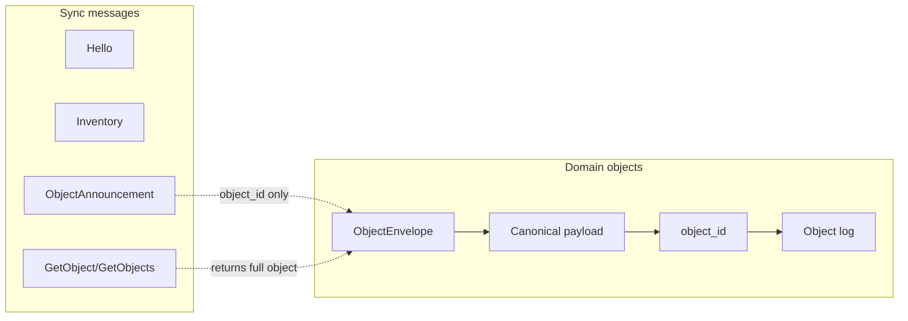

**Правило:** `ObjectAnnouncement` говорит только: «у меня есть объект». Он не доказывает, что объект валиден.

<!-- speaker: 25 секунд. Это предотвращает смешивание delivery и truth. Истина появляется только после canonical hash, подписи, зависимостей и конфликтов. -->

---

# 5. Storage Layer

**Роль:** сохранить все полученные объекты и локальные выводы, не превращая derived state в источник истины.

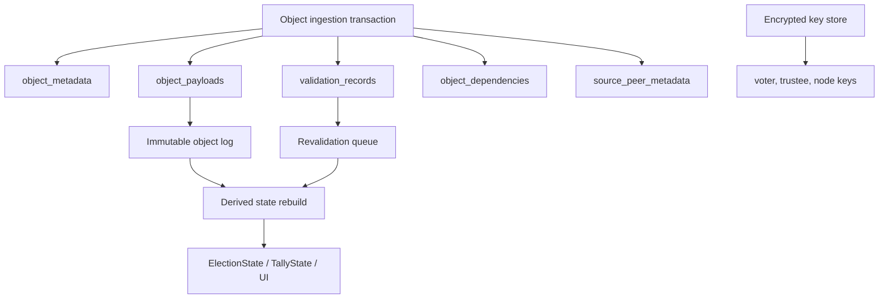

**Инвариант:** если derived state поврежден или устарел, его можно пересчитать из retained objects.

<!-- speaker: 30 секунд. SQLite хранит payload, metadata, validation records, dependencies, sync state и зашифрованные ключи. Но главное - object log. -->

---

# 6. Data Model

**Роль:** описать неизменяемые объекты, зависимости и конфликтные ключи.

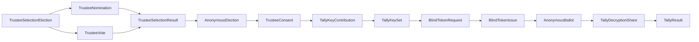

**Главное:** `TrusteeSelectionResult` и `TallyResult` публикуются для удобства, но принимаются только после локального пересчета.

<!-- speaker: 35 секунд. Data model фиксирует две большие части: выбор trustees и основное анонимное голосование. -->

---

# 7. Crypto Layer

**Роль:** дать проверяемую идентичность объектов, подписи, приватность бюллетеня и threshold-раскрытие результата.

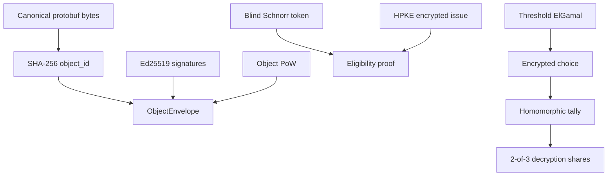

**Ключевая граница:** криптографические проверки выполняются над canonical bytes и явно заданными signing/proof payloads, а приватные ключи не попадают в сетевые объекты.

<!-- speaker: 35 секунд. Набор примитивов: canonical hashing, Ed25519, PoW, blind tokens, HPKE, threshold ElGamal и local key encryption. -->

---

# 8. Validation Layer

**Роль:** превратить «получен объект» в один из локальных статусов.

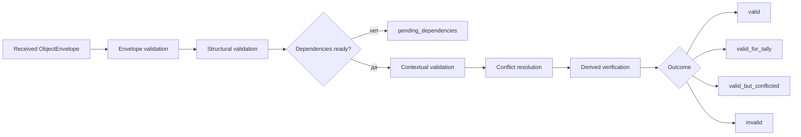

**Конфликтное правило:** если в conflict group больше одного валидного объекта, вся группа исключается. Нет победителя по времени, peer, PoW или hash.

<!-- speaker: 40 секунд. Валидация стадийная: envelope, структура, зависимости, контекст, конфликты, derived verification. Это сердце локального консенсуса без блокчейна. -->

---

# 9. Trustee Selection Layer

**Роль:** публично и детерминированно выбрать trustees для анонимного голосования.

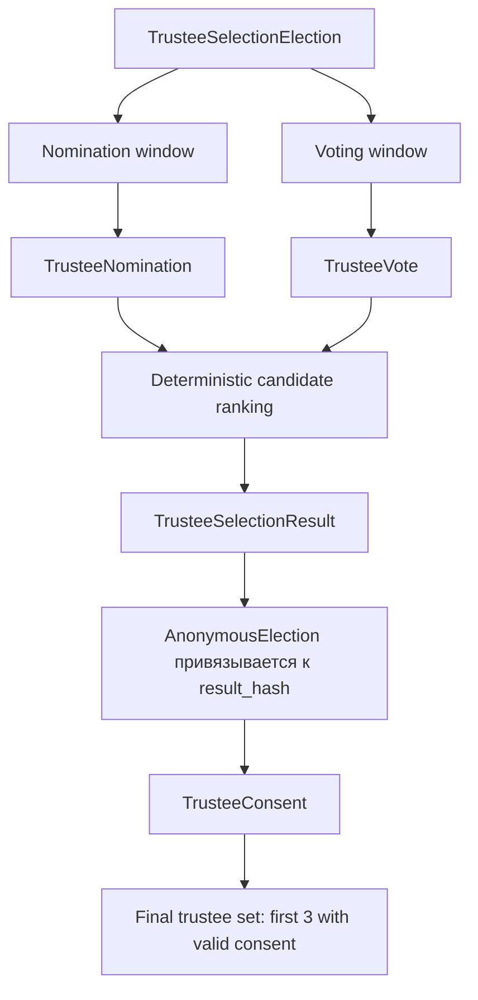

**Параметры:** `n = 3`, `t = 2`, `max_choices_per_vote = 3`.

<!-- speaker: 30 секунд. Trustee selection публичный и неанонимный. Его задача - получить упорядоченный список кандидатов, а затем финальный набор из тех, кто дал consent. -->

---

# 10. Blind Token Issuance

**Роль:** выдать право анонимного голосования так, чтобы trustees знали eligibility, но не знали будущий token.

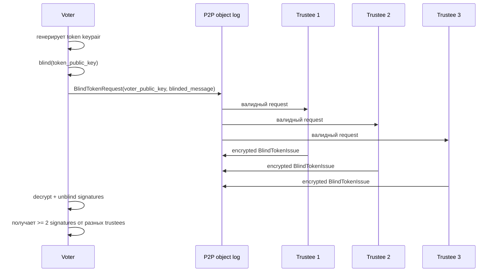

**Privacy split:** `BlindTokenRequest` публично показывает участие voter, но `AnonymousBallot` уже не содержит `voter_public_key`.

<!-- speaker: 40 секунд. Это мост между публичным allowlist и анонимным бюллетенем. Trustees подписывают blinded message, поэтому не узнают token_public_key. -->

---

# 11. Ballots Layer

**Роль:** принять один анонимный encrypted vote от holder'а валидного token proof.

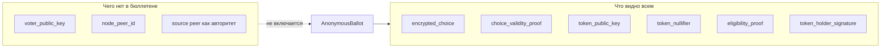

**Double voting policy:** один `election_id || token_nullifier` должен иметь один валидный ballot. Несколько валидных бюллетеней с тем же nullifier исключаются все.

<!-- speaker: 35 секунд. Анонимность здесь криптографическая, не сетевая. Timing и первый распространитель могут оставаться metadata-риском. -->

---

# 12. Tally Layer

**Роль:** посчитать результат из `valid_for_tally` бюллетеней и проверить опубликованный `TallyResult`.

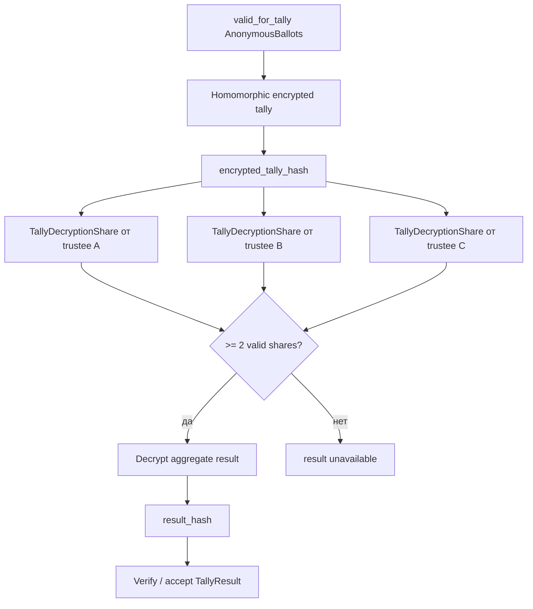

**Важно:** поздние валидные объекты могут сделать результат stale, тогда tally пересчитывается.

<!-- speaker: 40 секунд. TallyResult не авторитетен. Узел проверяет decryption shares и сверяет result_hash с локально пересчитанным результатом. -->

---

# End-to-End Timeline

```mermaid
gantt
  title LibreVote election lifecycle
  dateFormat  X
  axisFormat %s
  section Trustee selection
  Nomination                 :a1, 0, 10
  Public trustee voting      :a2, 10, 20
  Result verification        :a3, 20, 25
  Consent                    :a4, 25, 35
  section Activation
  DKG contributions          :b1, 35, 45
  TallyKeySet                :b2, 45, 50
  section Anonymous election
  Blind token issuance       :c1, 50, 65
  Anonymous voting           :c2, 65, 85
  section Results
  Decryption shares          :d1, 85, 95
  TallyResult verification   :d2, 95, 100
```

**Переходы фаз задаются объектами и временными окнами.** Голосование становится operationally active только после валидного `TallyKeySet`.

<!-- speaker: 35 секунд. Здесь связать все слои в один сценарий: сначала выбираем trustees, потом активируем anonymous election, потом issuance, voting и tally. -->

---

# Threat Model: Что Защищаем

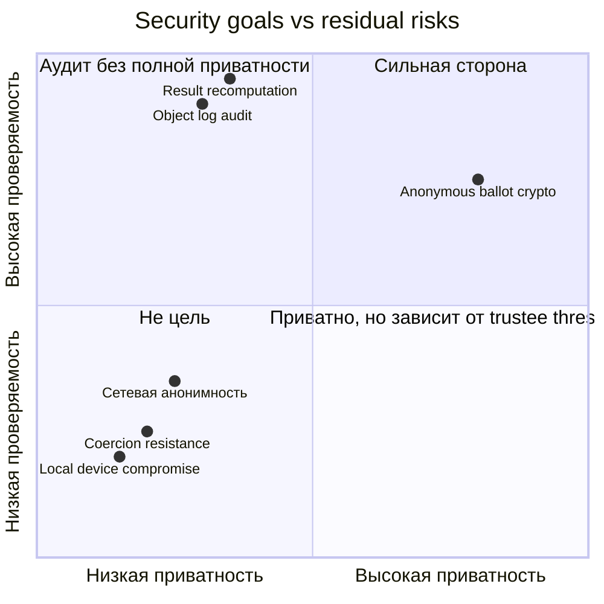

**Защищаем:** подмену объектов, result forgery, double voting, invalid decryption shares.

**Не обещаем:** coercion resistance, receipt-freeness, сильную сетевую анонимность, защиту при компрометации локального устройства.

<!-- speaker: 40 секунд. Честно проговорить границы. Если 2 из 3 trustees сговорились, они могут нарушить privacy threshold. Если меньше 2 доступны на tally, результат не раскрывается. -->

---

# Финальная Схема: Где Возникает Доверие

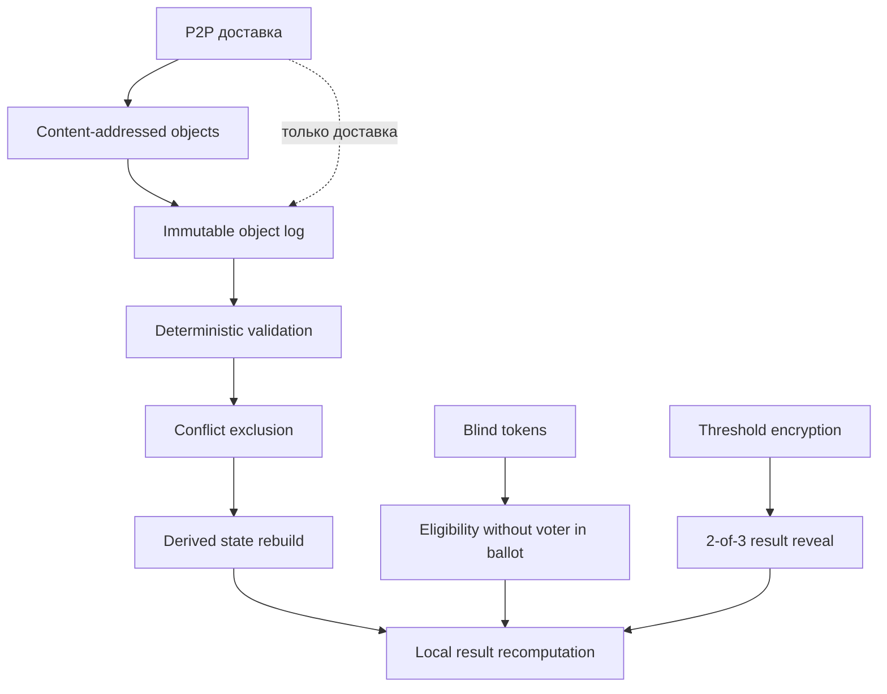

