# LibreVote

# Главный Тезис

LibreVote строит доверие не через центральный сервер, а через три механизма:

1. **Неизменяемый журнал объектов:** все важные события являются неизменяемыми объектами.
2. **Детерминированная локальная проверка:** каждый узел сам решает, что валидно.
3. **Криптографическая приватность:** право голоса отделяется от личности через слепые токены, а выбор шифруется пороговым ключом.

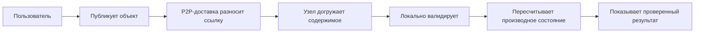

<!-- speaker: 30 секунд. Подчеркнуть: сеть только доставляет, но не делает объект истинным. Результат тоже не авторитетен, пока узел не пересчитал его сам. -->

---

# Карта Слоев

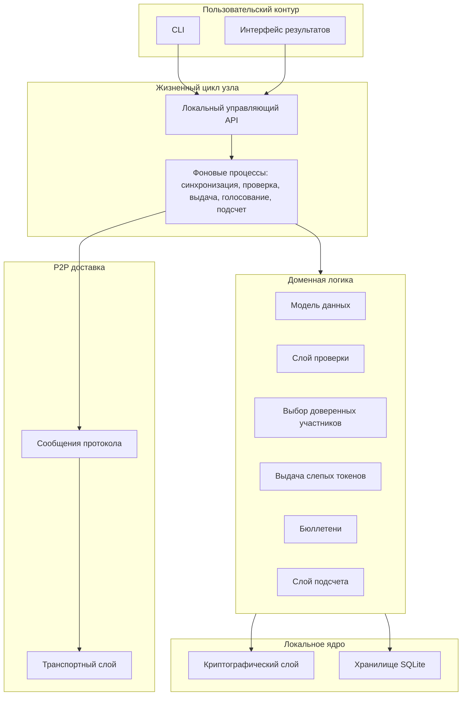

<!-- speaker: 45 секунд. Это главный слайд про слои. Снизу транспорт, выше протокол сообщений, рядом локальное ядро, сверху доменная логика и CLI. -->

---

# 1. CLI И Локальный Управляющий API

**Роль:** безопасная точка входа для оператора, избирателя и доверенного участника.

CLI не должен напрямую менять SQLite и не должен обходить процесс узла. Он вызывает локальный управляющий API работающего узла.

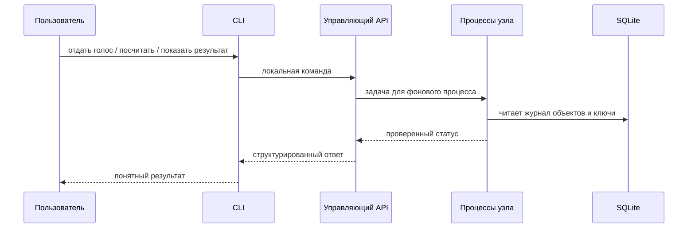

**Почему отдельный слой важен:** команды пользователя остаются воспроизводимыми, а вся доменная логика проходит через единый жизненный цикл узла.

<!-- speaker: 20 секунд. У CLI роль интерфейса, а не источника истины. Это снижает риск, что разные команды создадут разные правила работы с данными. -->

---

# 2. Жизненный Цикл Узла

**Роль:** собрать транспорт, сеть, хранилище, ключи и фоновые процессы в один управляемый узел.

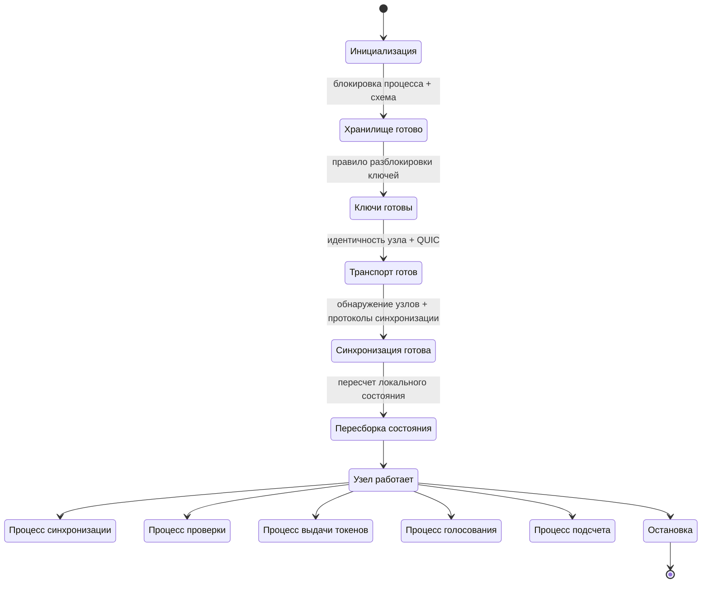

**Ключевая идея:** после падения узел может восстановиться из журнала объектов и заново построить производное состояние.

<!-- speaker: 20 секунд. Жизненный цикл узла отвечает за порядок запуска и восстановление. Производное состояние не является источником истины, поэтому пересборка безопасна. -->

---

# 3. Транспортный Слой

**Роль:** соединять узлы, не зная ничего о голосованиях.

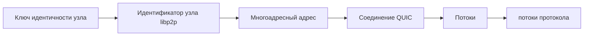

**Что делает слой:**

- идентичность узла, QUIC, многоадресные адреса, потоки;
- таймауты, лимиты, жизненный цикл соединений;
- базовая достижимость узла и особенности NAT.

**Что не делает:** не проверяет бюллетени, не считает результат, не знает ключи избирателя.

<!-- speaker: 20 секунд. Важно отделить ключ узла от ключей избирателя и доверенного участника: сетевой узел не равен избирателю. -->

---

# 4. Сообщения Протокола

**Роль:** разделить доменные объекты и служебные сетевые сообщения.

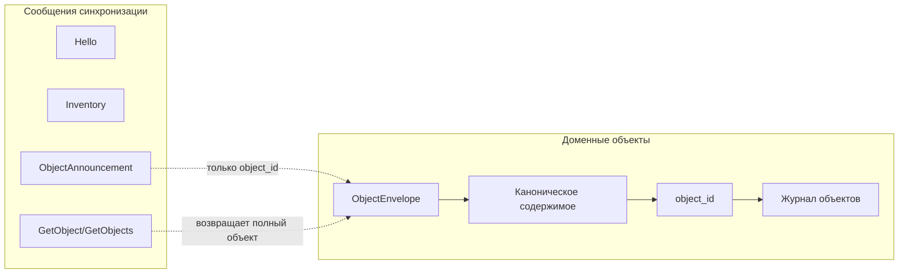

**Правило:** `ObjectAnnouncement` говорит только: «у меня есть объект». Он не доказывает, что объект валиден.

<!-- speaker: 25 секунд. Это предотвращает смешивание доставки и истины. Истина появляется только после канонического хеша, подписи, зависимостей и конфликтов. -->

---

# 5. Слой Хранения

**Роль:** сохранить все полученные объекты и локальные выводы, не превращая производное состояние в источник истины.

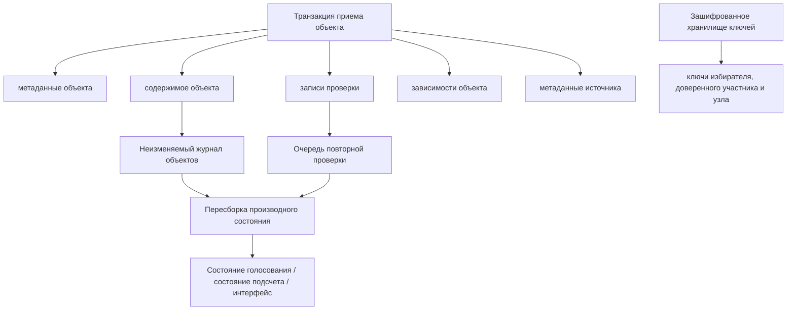

**Инвариант:** если производное состояние повреждено или устарело, его можно пересчитать из сохраненных объектов.

<!-- speaker: 30 секунд. SQLite хранит содержимое, метаданные, записи проверки, зависимости, состояние синхронизации и зашифрованные ключи. Но главное - журнал объектов. -->

---

# 6. Модель Данных

**Роль:** описать неизменяемые объекты, зависимости и конфликтные ключи.

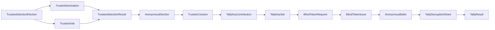

**Главное:** `TrusteeSelectionResult` и `TallyResult` публикуются для удобства, но принимаются только после локального пересчета.

<!-- speaker: 35 секунд. Модель данных фиксирует две большие части: выбор доверенных участников и основное анонимное голосование. -->

---

# 7. Криптографический Слой

**Роль:** дать проверяемую идентичность объектов, подписи, приватность бюллетеня и пороговое раскрытие результата.

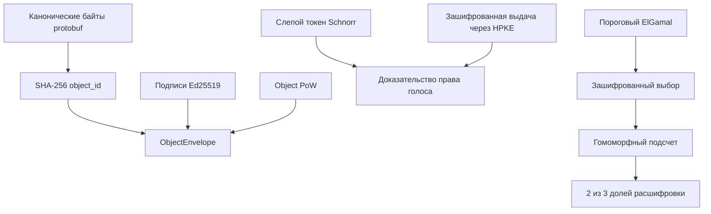

**Ключевая граница:** криптографические проверки выполняются над каноническими байтами и явно заданными данными для подписи или доказательства, а приватные ключи не попадают в сетевые объекты.

<!-- speaker: 35 секунд. Набор примитивов: каноническое хеширование, Ed25519, PoW, слепые токены, HPKE, пороговый ElGamal и локальное шифрование ключей. -->

---

# 8. Слой Проверки

**Роль:** превратить «получен объект» в один из локальных статусов.

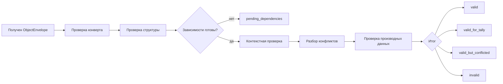

**Конфликтное правило:** если в конфликтной группе больше одного валидного объекта, вся группа исключается. Нет победителя по времени, узлу, PoW или хешу.

<!-- speaker: 40 секунд. Проверка стадийная: конверт, структура, зависимости, контекст, конфликты, проверка производных данных. Это сердце локального консенсуса без блокчейна. -->

---

# 9. Слой Выбора Доверенных Участников

**Роль:** публично и детерминированно выбрать доверенных участников для анонимного голосования.

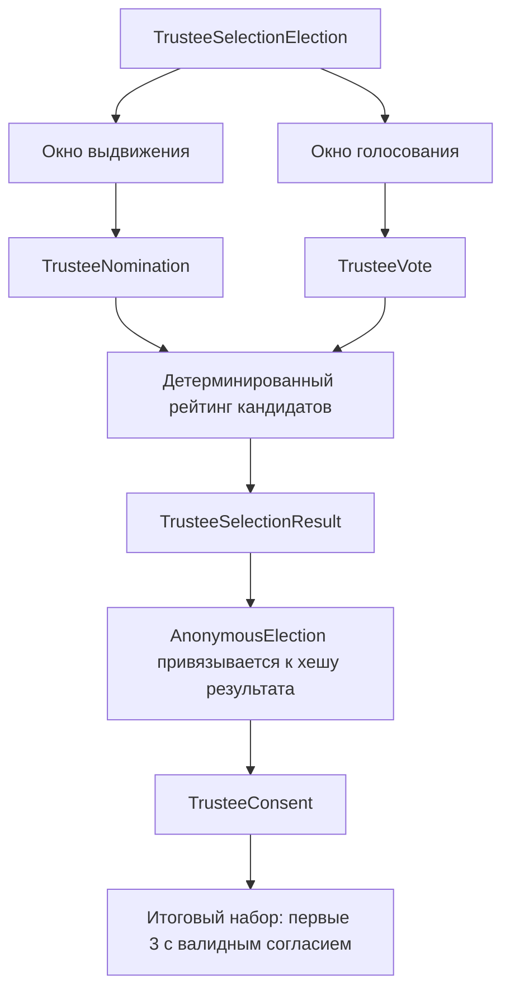

**Параметры:** `n = 3`, `t = 2`, `max_choices_per_vote = 3`.

<!-- speaker: 30 секунд. Выбор доверенных участников публичный и неанонимный. Его задача - получить упорядоченный список кандидатов, а затем финальный набор из тех, кто дал согласие. -->

---

# 10. Выдача Слепых Токенов

**Роль:** выдать право анонимного голосования так, чтобы доверенные участники знали право избирателя на голос, но не знали будущий токен.

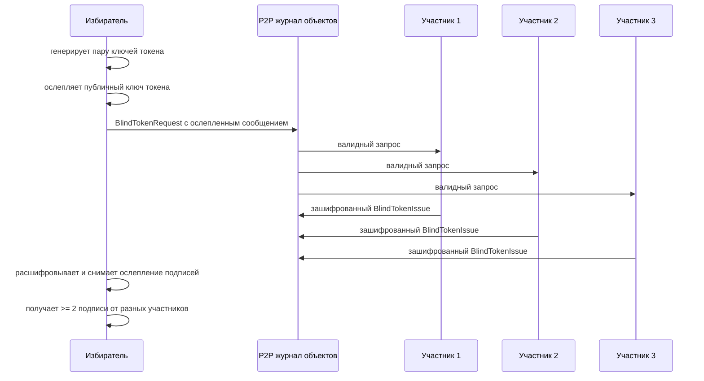

**Разделение приватности:** `BlindTokenRequest` публично показывает участие избирателя, но `AnonymousBallot` уже не содержит `voter_public_key`.

<!-- speaker: 40 секунд. Это мост между публичным списком избирателей и анонимным бюллетенем. Доверенные участники подписывают ослепленное сообщение, поэтому не узнают публичный ключ токена. -->

---

# 11. Слой Бюллетеней

**Роль:** принять один анонимный зашифрованный голос от владельца валидного доказательства токена.

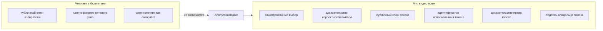

**Правило повторного голосования:** одна пара `election_id || token_nullifier` должна иметь один валидный бюллетень. Несколько валидных бюллетеней с тем же идентификатором использования токена исключаются все.

<!-- speaker: 35 секунд. Анонимность здесь криптографическая, не сетевая. Время публикации и первый распространитель могут оставаться риском утечки метаданных. -->

---

# 12. Слой Подсчета

**Роль:** посчитать результат из бюллетеней со статусом `valid_for_tally` и проверить опубликованный `TallyResult`.

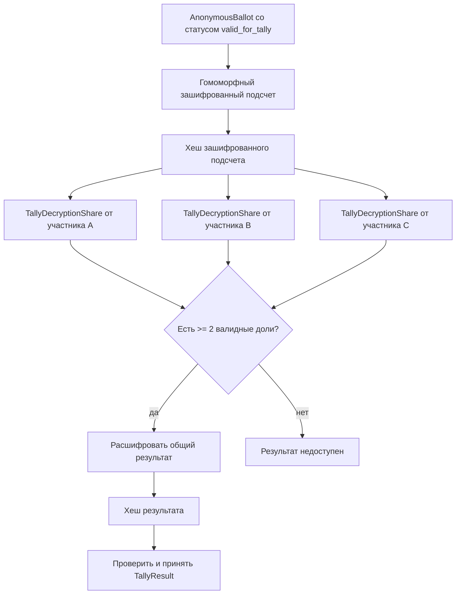

**Важно:** поздние валидные объекты могут сделать результат устаревшим, тогда подсчет пересчитывается.

<!-- speaker: 40 секунд. TallyResult не авторитетен. Узел проверяет доли расшифровки и сверяет хеш результата с локально пересчитанным результатом. -->

---

# Сквозная Временная Линия

```mermaid
gantt
  title Жизненный цикл голосования LibreVote
  dateFormat  X
  axisFormat %s
  section Выбор доверенных участников
  Выдвижение кандидатов      :a1, 0, 10
  Публичное голосование      :a2, 10, 20
  Проверка результата        :a3, 20, 25
  Согласие участников        :a4, 25, 35
  section Активация
  Вклады DKG                 :b1, 35, 45
  TallyKeySet                :b2, 45, 50
  section Анонимное голосование
  Выдача слепых токенов      :c1, 50, 65
  Анонимное голосование      :c2, 65, 85
  section Результаты
  Доли расшифровки           :d1, 85, 95
  Проверка TallyResult       :d2, 95, 100
```

**Переходы фаз задаются объектами и временными окнами.** Голосование становится фактически активным только после валидного `TallyKeySet`.

<!-- speaker: 35 секунд. Здесь связать все слои в один сценарий: сначала выбираем доверенных участников, потом активируем анонимное голосование, потом выдача токенов, голосование и подсчет. -->

---

# Модель Угроз: Что Защищаем

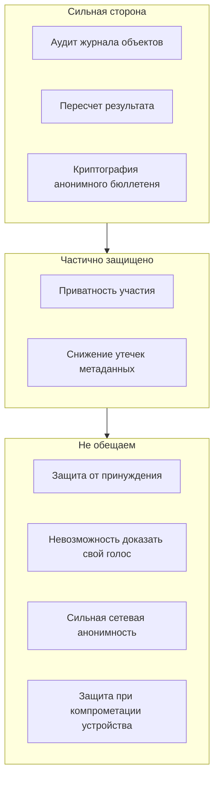

**Защищаем:** подмену объектов, подделку результата, повторное голосование, невалидные доли расшифровки.

**Не обещаем:** защиту от принуждения, невозможность доказать свой голос, сильную сетевую анонимность, защиту при компрометации локального устройства.

<!-- speaker: 40 секунд. Честно проговорить границы. Если 2 из 3 доверенных участников сговорились, они могут нарушить порог приватности. Если меньше 2 доступны на этапе подсчета, результат не раскрывается. -->

---

# Финальная Схема: Где Возникает Доверие

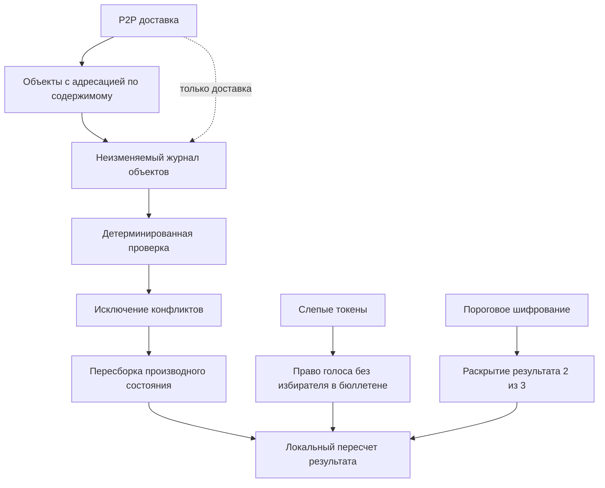

## Одно предложение

LibreVote - это P2P-система, где доставка распространяет неизменяемые объекты, а доверие к голосованию появляется только после локальной криптографической проверки, исключения конфликтов и пересчета результата каждым узлом.

<!-- speaker: 20 секунд. Закрыть презентацию одной фразой и вернуться к главному тезису: доставка не равна истине; истина локально пересчитывается. -->
